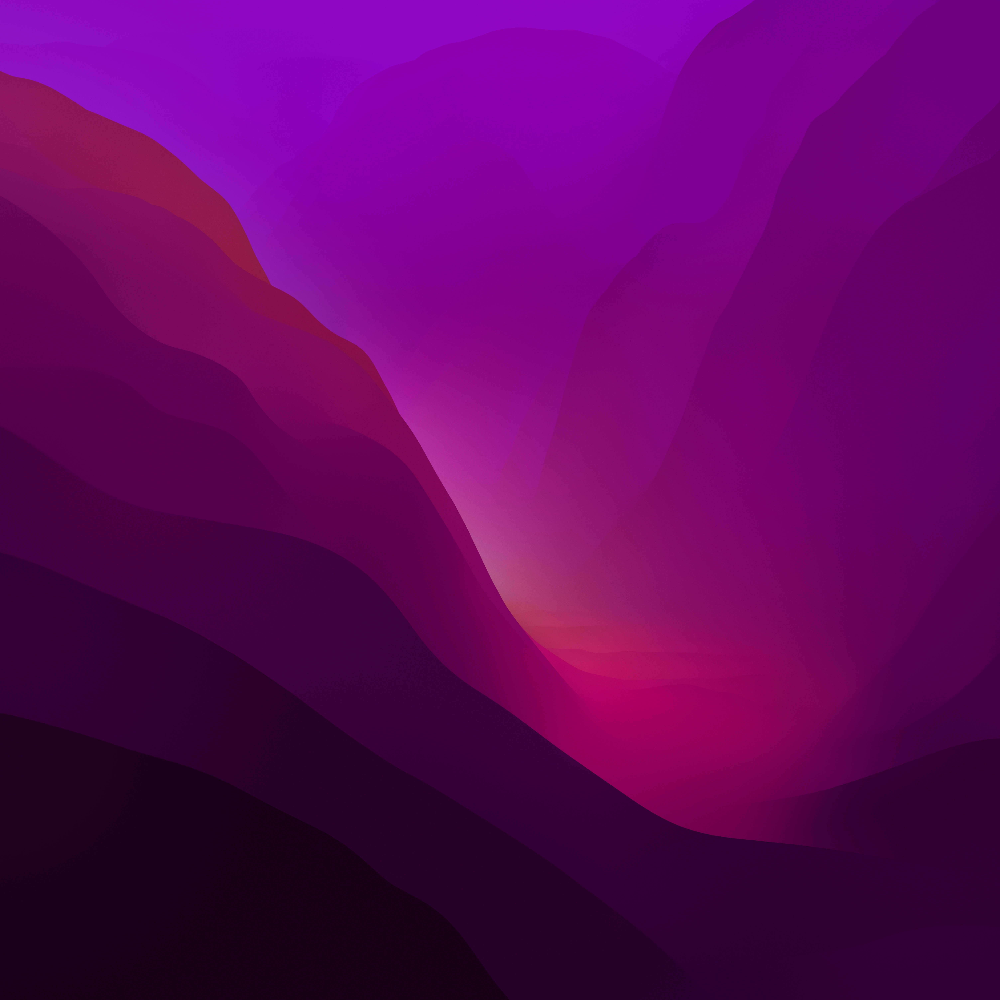

# Testing shaders

### Goal: recreate this image:

### stuff to look at:

some book: https://thebookofshaders.com/05/

nice shader library: https://lygia.xyz/ , https://github.com/patriciogonzalezvivo/lygia
shader function visualizer: https://graphtoy.com/

directly displaying glsl: https://github.com/patriciogonzalezvivo/glslCanvas
display in terminal: https://github.com/patriciogonzalezvivo/glslViewer?tab=readme-ov-file
online editor: https://editor.thebookofshaders.com/